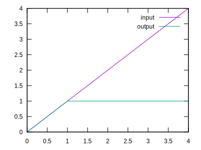
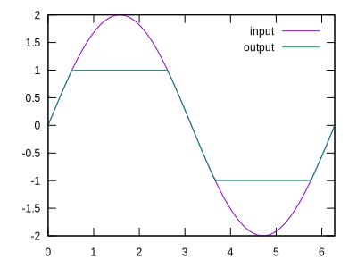
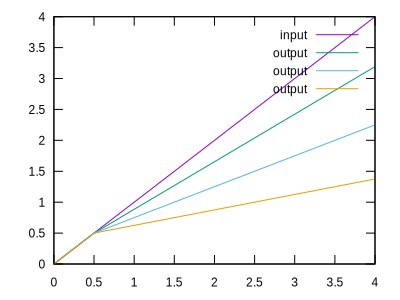
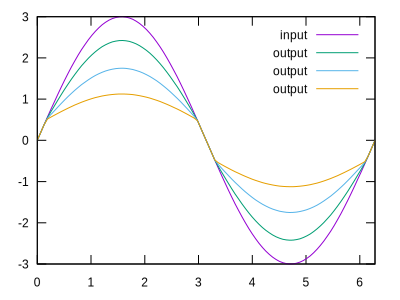
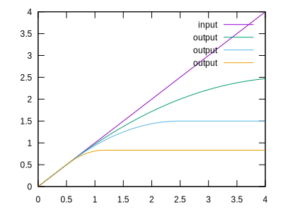
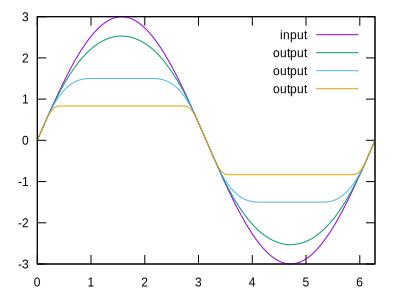
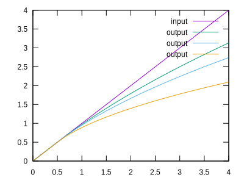
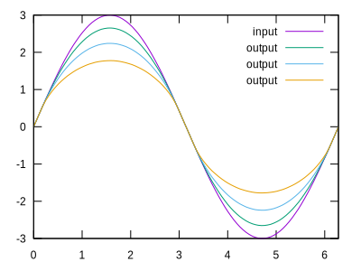
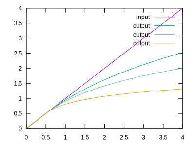
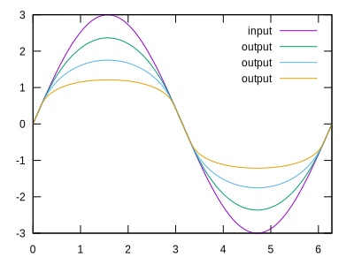

Distortion Tutorial
===================

This tutorial walks through using AMP to apply distortion to an input signal,
commonly added to guitar signals to provide a grittier signal. For a complete
and documented use of distortion, see the [Distortion
Example](../ex/dist.ml).

## Clipping

The first and most basic form of distortion covered is clipping. All clipping
effects take a large input signal and generate a smaller output where the
extreme values are "bent" inward to decrease the size of the signal.

Mathematically, all clipping effects are linear near an input of zero.
Therefore, small input signals will pass mostly unaffected. As the input gets
larger, the change in output will tend towards zero. Many clipping effects are
sigmoid in shape and contain horizontal asymptotes, although some clipping
methods such as root and logarithmic clipping grow infinitely large with a
derivative that approaches zero.

Every clipping effect comes in four forms: positive, negative, symmetric, and
asymmetric. The positive form only clips positive values, leaving negative
inputs unaffected. Likewise, the negative form only clips negative values.
Symmetric clipping performs the exact same clipping procedure on both positive
and negative values. Lastly, asymmetric clipping uses unique parameters to
clip the positive and negative values, producing an asymmetric output with
added even harmonics. For hard clipping, the four constructors are
`HardClipP`, `HardClipN`, `HardClipS`, and `HardClipA` for positive, negative,
symmetric, and asymmetric clipping, respectively.

Additionally, every clipper (except `HardClip` and `SoftClip`) has the two
parameters `sat` for saturation and `dist` for distortion. The `sat` parameter
specifies the range in which the clipper is linear -- i.e. any values smaller
than `sat` will not be affected. The `dist` parameter specifies the amount of
distortion to be applied above the saturation point. Starting from a value of
`0.0` meaning no distortion, higher values increase the rate and amount of
distortion as the input gets larger. A distortion value `dist` of infinity
implies hard clipping where the input cannot exceed the saturation value
`sat`.

### Hard Clipping

The most basic form of clipping, hard clipping, truncates any values that
exceed a limit. For example, hard clipping with a limit of `0.2` will allow
any value less than `0.2` to pass through. Any values above `0.2` will be
truncated to exactly `0.2`. Because hard clipping causes a very abrupt cutoff,
the result is typically perceived as harsh and may be allievated with a
subsequent low pass filter.

    HardClipP max
    HardClipN max
    HardClipS max
    HardClipA (maxlo,maxhi)

The hard clip constructors above all specify the maximum values that can be
output. For asymmetric clipping with `HardClipA`, seperate minimum and maximum
values are available. The following pair of graphs demonstrates hard clipping
with a limit of `1.0`.

### Soft Clipping

Soft clipping provides a smoother version of hard clipping. The `max`
parameter specifies the largest input before the clipper is fully saturated.
The input corresponding to complete saturation is exactly `2*max`.

    SoftClipP max
    SoftClipN max
    SoftClipS max
    SoftClipA (maxlo,maxhi)

As shown by the below pair of graphs, the soft clipper limits the output
within the specified range while softening edges near the extremes. The
relationship between the output and input is near linear near zero (but not
exactly), increasing in distortion as the input approaches the maximum.

### Linear Clipping

Linear clipping is a primitive method of "soft" clipping that linearly scales
the input after reaching the initial saturation point. I am honestly not sure
what good this is for but feel free to experiment.

    LinClipP (sat, dist)
    LinClipN (sat, dist)
    LinClipS (sat, dist)
    LinClipA (distlo, satlo, sathi, disthi)

A higher `dist` parameter increases the scaling after saturation. The
following graphs use a saturation of `0.5` and varying distortion parameters
to produce a jaggy version of the input.

### Polynomial Clipping

Polynomial clipping -- maybe better named quadratic clipping -- is a very fast
method of "soft" clipping that gradually transitions from linear to flat. The
output follows a quadratic curve to that begins with a slope of one (i.e.
linear) and transitions to a slope of zero (i.e. flat). If the input signal is
too large,the output never increaases beyond maximum saturation, completely
masking higher frequency information.

    PolyClipP (sat, dist)
    PolyClipN (sat, dist)
    PolyClipS (sat, dist)
    PolyClipA (distlo, satlo, sathi, disthi)

### Root Clipping

Root clipping uses the square root function to distort the input signal. The
output is scaled such that squaring the size of the input will generate a
response approximately double in the output. This provides a very light amount
of clipping.

    RootClipP (sat, dist)
    RootClipN (sat, dist)
    RootClipS (sat, dist)
    RootClipA (distlo, satlo, sathi, disthi)

### Logarithmic Clipping

Logarithmic clipping follows a logarithmic curve to distort the signal. The
output is scaled such that an order of magnitude increase on the input will
result in approximately doubling the output. This provides an exponentially
more drastic gain reduction.

    LogClipP (sat, dist)
    LogClipN (sat, dist)
    LogClipS (sat, dist)
    LogClipA (distlo, satlo, sathi, disthi)

## Bitcrushing
